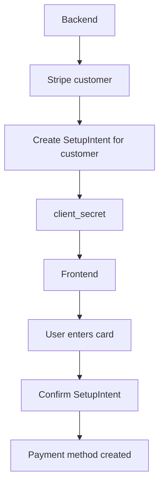
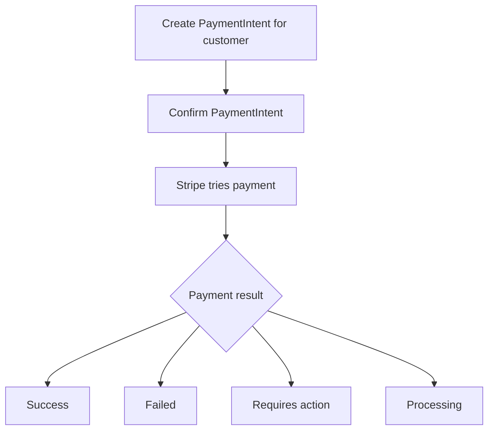
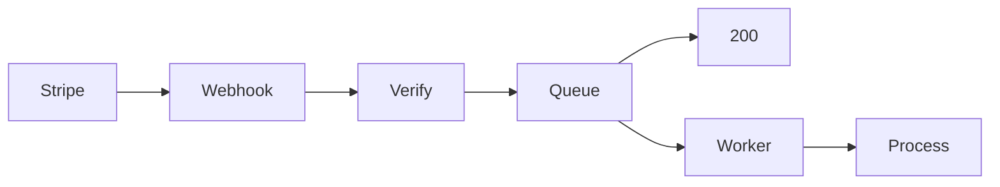
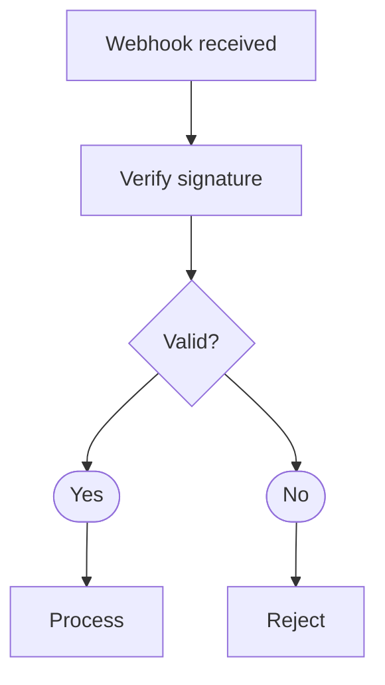
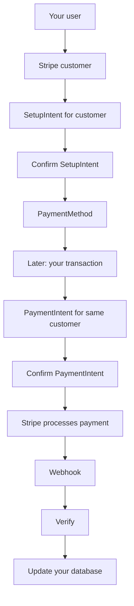
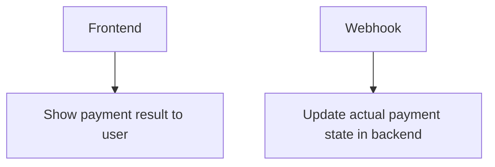

Hi, I'll be writing about Stripe integration and how you can integrate Stripe payment into your application.

This guide is only for a particular case where you want to manage most of the things by yourself and don't want to rely on Stripe for anything other than payment itself.

I will also not provide much code here because code is not the hard part. I just want to make sure you understand the flow and mental model properly. After that you can figure out the code by yourself.

To integrate Stripe we need mainly 3 things:

1. publishable key
2. Stripe secret key
3. Stripe webhook secret

Go ahead and get them first.

After you got them, we can continue.

## 1. Decide what payment method you want to support

First we need to decide which payment method we want to support.

Card is probably the most common one, but this depends on the business you are doing.

After deciding that, we need to decide how the user can add their payment method.

Payment method basically means the method we are going to use later to charge the user.

## 2. Adding payment method

To add a payment method, Stripe has something called `SetupIntent`.

This is mostly Stripe vocabulary, so just remember it.

`SetupIntent` is basically used when you want to collect a payment method now and use it later.

Before creating that, I would create a Stripe customer for the user.

Let's say your user id is:

```text
user_123
````

Stripe will create its own customer id something like:

```text
cus_xyz123
```

Store this Stripe customer id with your user.

You can also put your user id inside Stripe metadata. This can help later when you are debugging or trying to figure out which Stripe customer belongs to which user.

Now create the `SetupIntent` for this customer:

```text
customer: cus_xyz123
```

If the `SetupIntent` succeeds, Stripe attaches the payment method to this customer.

SetupIntent returns a `client_secret`.

There are other fields also, but for now this is the important one.

## 3. Send client secret to frontend

Now you got the `client_secret`.

Send that to frontend.

On frontend you can use Stripe Elements or Payment Element.

For that you mainly need:

```text
publishable key
+
client_secret
```

Then user enters their card details.

After that you need to confirm the SetupIntent.

This part is important because just showing the Stripe element does not mean the payment method is added.

The flow is basically:



Boom.

Now we have the payment method.

## 4. Now let's charge the user

Now payment method is ready.

So let's focus on payment.

For payment Stripe has another thing called `PaymentIntent`.

Again, Stripe vocabulary.

PaymentIntent basically represents the payment you are trying to make.

For payment we need a few things.

Because the payment method belongs to a Stripe customer, use the same customer id when creating the `PaymentIntent`.

### Amount

Stripe normally accepts the amount in the smallest unit of the currency.

For example if you are using USD:

```text
$10 = 1000
```

So usually you multiply by 100.

But don't assume every currency works the same because some currencies don't have decimal values.

### Currency

You also need currency.

Something like:

```text
usd
```

### PaymentMethodId

We already created the payment method before.

Now we need that payment method id.

Something like:

```text
pm_xyz123
```

### Idempotency key

This one is important.

Create some unique idempotency key for that particular transaction.

For example:

```text
txn_123_payment
```

Why do we need this?

Let's say you send a request to Stripe.

Stripe charged the user.

But because of network issue your backend did not get the response.

Now your backend might retry the request.

Without idempotency, you don't want to accidentally create another payment.

So if you retry with the same idempotency key, Stripe can understand that this is the same operation.

This is really useful for retry logic.

## 5. Create PaymentIntent

Now if we have:

```text
customerId
amount
currency
paymentMethodId
idempotencyKey
```

we can create the `PaymentIntent`.

But one thing to remember here.

Creating PaymentIntent does not mean payment is successful.

You still need to confirm it.

Think about it like:



There are more states, but don't worry about all of them right now.

Just remember this:

```text
PaymentIntent created != payment successful
```

This is probably one of the important things to understand.

## 6. Now webhook

Now we can make payment, but we also need to know what happened with that payment.

For that we have webhooks.

Stripe can send events like:

```text
payment_intent.succeeded

payment_intent.payment_failed
```

and many more.

When webhook comes to your backend, you can decide how you want to process it.

You can do something simple like:


Or you can do:



This part depends on your architecture.

Maybe your application is small and you don't need queue or Kafka or anything.

Maybe your application is large and you want everything async.

You decide what makes sense for your system.

## 7. Verify webhook

Now there is another problem.

Your webhook endpoint is still an endpoint on the internet.

So how do we know the request actually came from Stripe?

This is where the Stripe webhook secret comes in.

When you receive the webhook, verify the Stripe signature using the webhook secret.

If it is valid, process it.

If it is not valid, reject it.

Basically:



And that's pretty much the main flow.

## Full flow

So if we put everything together:



That's pretty much the mental model I want you to understand.

## One thing you should not do

Don't completely trust frontend when it says payment is successful.

Frontend is mainly there for user experience.

Your backend should manage the actual payment state.

So something like:



If Stripe tells you through webhook that payment succeeded, then you can update your transaction in the database.

## Duplicate payment method

There are still things we are not handling here.

For example duplicate payment methods.

Maybe the user adds the same card multiple times.

Stripe provides something called `fingerprint`.

You can use the fingerprint as one way to figure out if the same card already exists.

Don't treat fingerprint as some perfect solution for everything, but it is useful for this type of case.

## There is a lot more

This is only one way of doing Stripe integration.

Stripe provides a lot more things.

Checkout, subscriptions, invoices, refunds, disputes, off-session payment, 3D Secure and a lot of other stuff.

You need to understand what each thing is doing and why it exists.

After that you can decide what is best for your application and your organization.


## AI usage
Well, I used AI for the grammar and the flow diagram.
